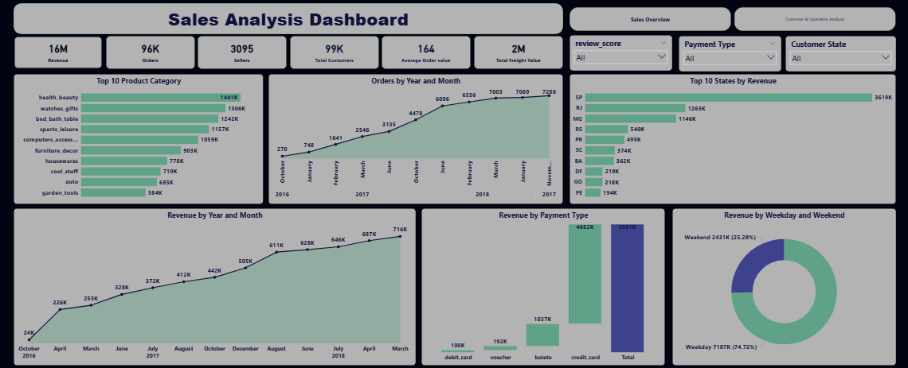
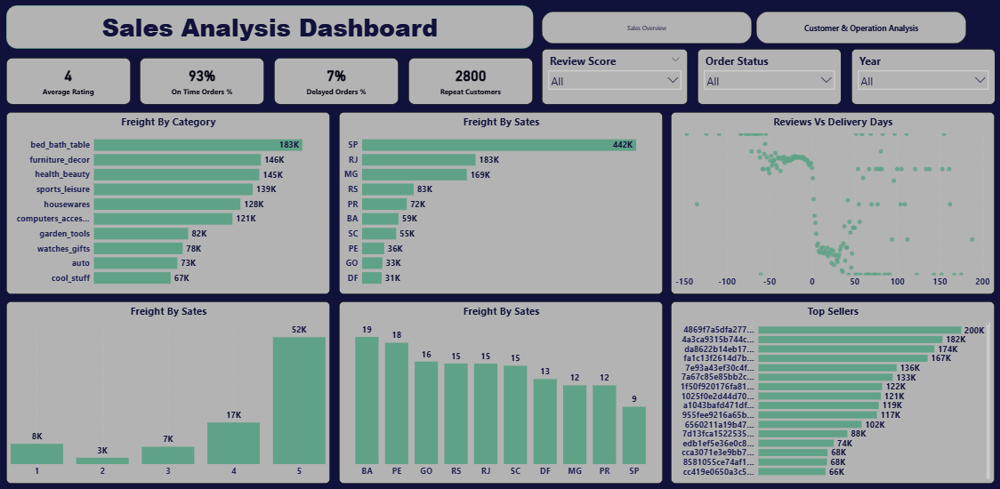

# Sales Analysis Dashboard | Olist E-commerce Dataset

## Overview

This project is an end-to-end Data Analysis project built using the Olist E-commerce dataset from Brazil. The goal of the project was to analyze sales performance, customer behavior, delivery operations, shipping costs, and payment trends using interactive dashboards in Power BI.

The project covers the complete data analysis workflow starting from data cleaning and transformation to data modeling, DAX calculations, KPI creation, and dashboard design.

---

# Dashboard Preview

## Sales Overview

## Customer & Operations Analysis

---

# Project Objectives

* Analyze overall sales performance and revenue trends
* Track order growth over time
* Understand customer purchasing behavior
* Analyze delivery performance and shipping operations
* Evaluate customer satisfaction using review scores
* Identify top-performing product categories and sellers
* Build interactive dashboards for business decision-making

---

# Tools & Technologies

* Power BI
* Power Query
* DAX
* Excel
* Data Modeling

---

# Dataset

Dataset: Olist Brazilian E-commerce Public Dataset

The dataset contains information about:

* Orders
* Customers
* Sellers
* Products
* Payments
* Reviews
* Geolocation

---

# Data Analysis Workflow

## 1. Data Cleaning & Transformation

Performed using Power Query:

* Removed duplicates and unnecessary columns
* Handled null values and invalid records
* Renamed columns for readability
* Changed data types
* Created calculated columns

---

## 2. Data Modeling

Built a Snowflake/Star Schema hybrid model by connecting:

* Orders
* Order Items
* Customers
* Sellers
* Products
* Payments
* Reviews
* Date Table

Created relationships between fact and dimension tables to support efficient analysis.

---

## 3. DAX Measures & KPIs

Created several business KPIs and calculations including:

* Total Revenue
* Total Orders
* Total Customers
* Average Order Value (AOV)
* Average Review Score
* Delayed Orders %
* On-Time Delivery %
* Revenue Growth MoM
* Revenue Growth YoY
* Repeat Customers
* Average Delivery Days

---

# Dashboard Pages

## 1. Sales Overview Dashboard

Focused on overall business performance.

### Included:

* Revenue Trend
* Orders Trend
* Revenue by Payment Type
* Revenue by Weekday vs Weekend
* Top Product Categories
* Top States by Revenue
* KPI Cards

### Key KPIs:

* Total Revenue
* Total Orders
* Total Customers
* Average Order Value
* Freight Value

---

## 2. Customer & Operations Analysis Dashboard

Focused on customer satisfaction and delivery operations.

### Included:

* Review Score Distribution
* Reviews vs Delivery Delay
* Freight by Category
* Freight by State
* Top Sellers
* Average Delivery Days by State

### Key KPIs:

* Average Rating
* On-Time Orders %
* Delayed Orders %
* Repeat Customers

---

# Key Insights

* Credit cards were the dominant payment method.
* Revenue showed strong growth throughout 2018.
* Delivery delays negatively impacted customer review scores.
* Some product categories generated significantly higher shipping costs.
* Customer purchasing behavior differed between weekdays and weekends.

---

# Challenges Faced

* Handling duplicated ZIP code values
* Building proper relationships between tables
* Creating dynamic DAX measures for growth analysis
* Designing clean and user-friendly dashboards

---

# What I Learned

Through this project, I improved my skills in:

* Power BI Dashboard Design
* Data Modeling
* DAX Calculations
* ETL Process
* Business Analysis
* Data Storytelling
* KPI Development

